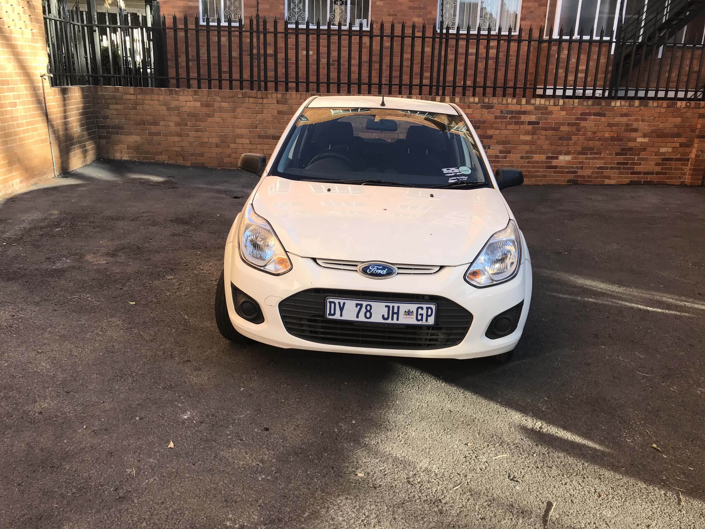
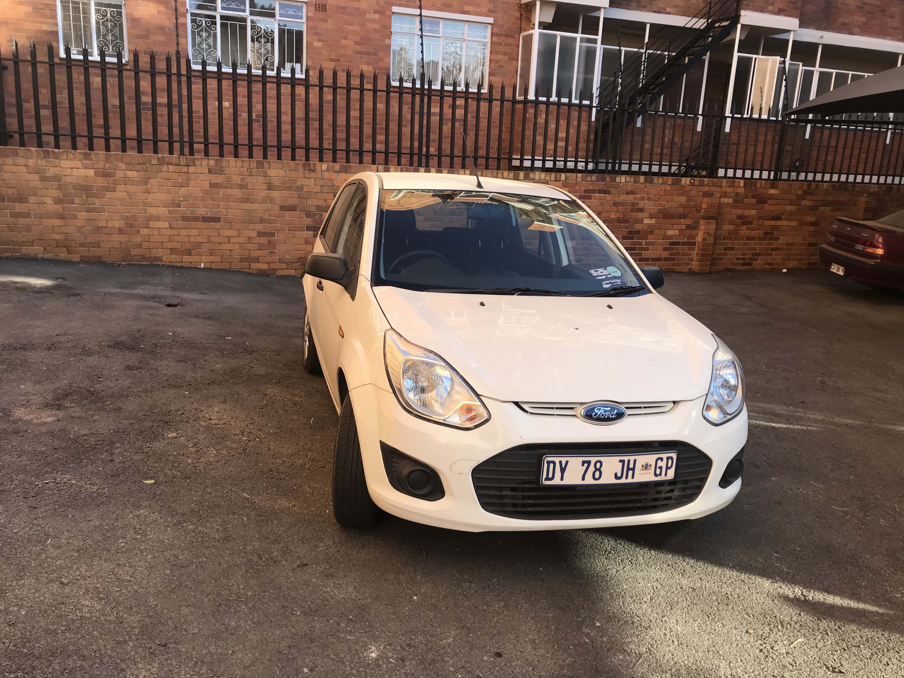
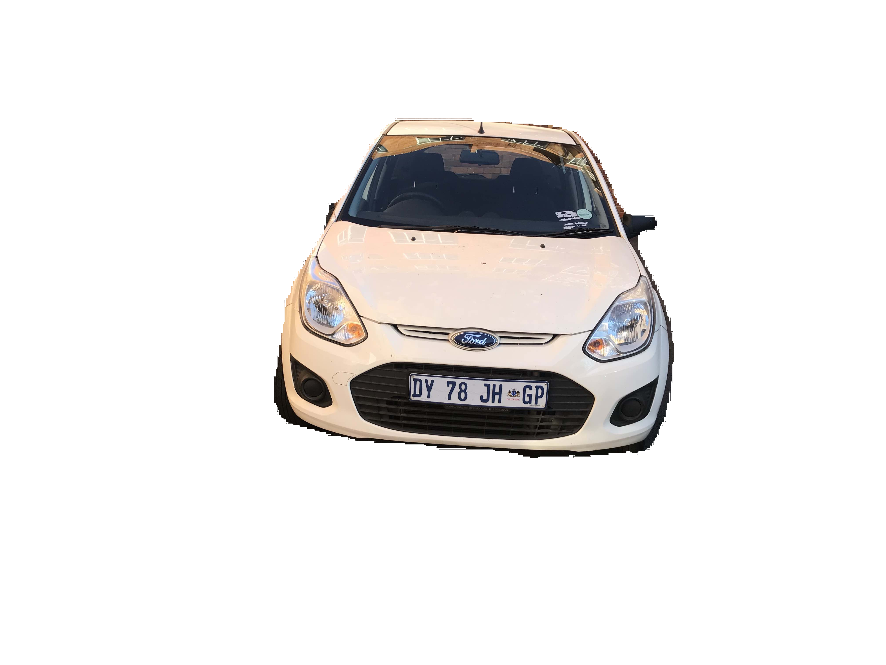
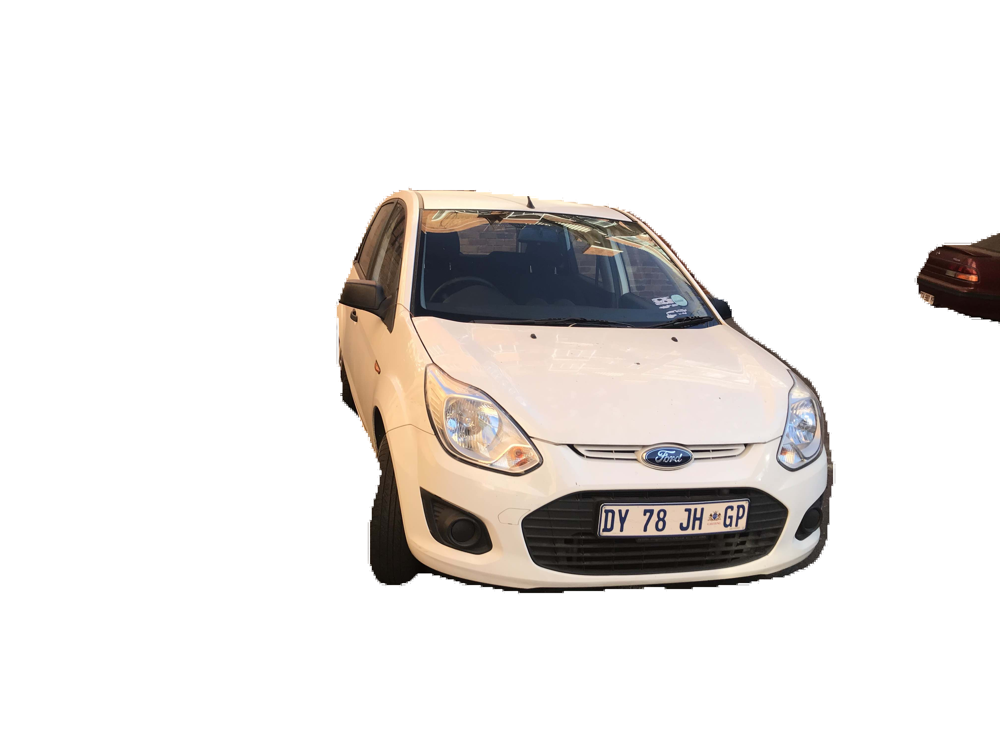
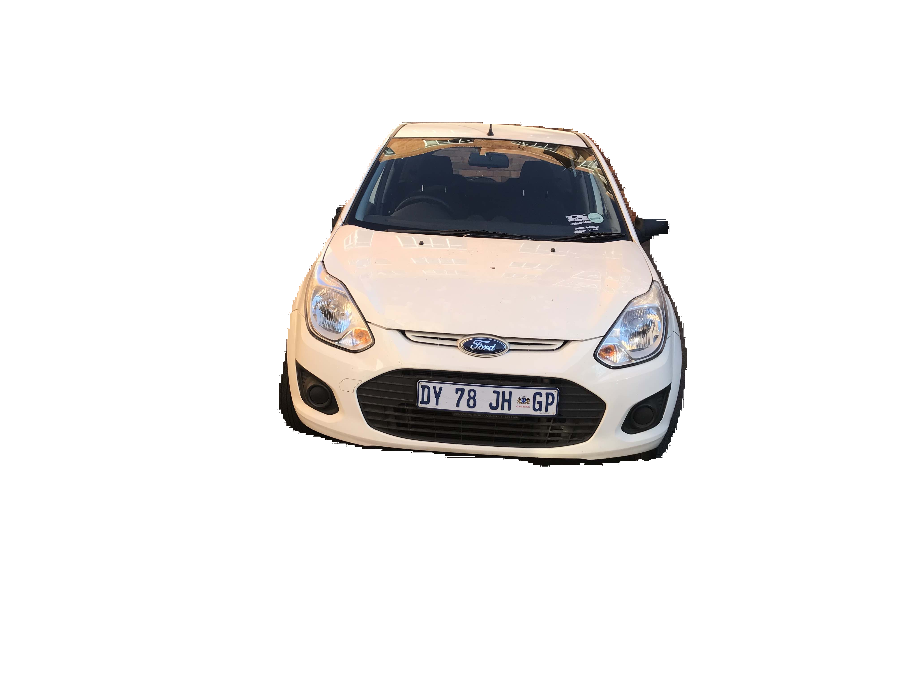
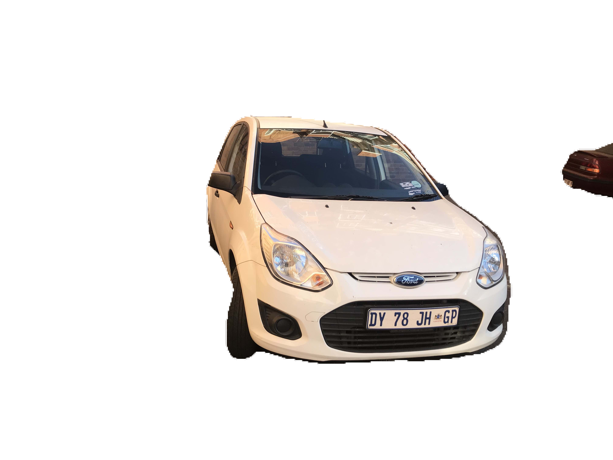

# Background removal

### Model used: [deeplabv3 pascalvoc model](https://drive.google.com/file/d/1Tbrsau2zdAord77yIOt_xxcnglWQPkp3/view?usp=sharing)

## Images:

  &emsp;
  

## Removed background:

  &emsp;
  

## White background:

  &emsp;
  

